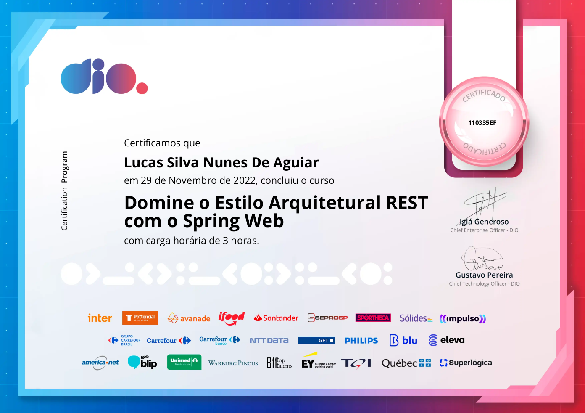

<h1 style="text-align:center;">REST-SpringWeb</h1>

<h2 style="text-align:center;">Rest com Spring MVC</h2>

- <b>Estilo arquitetural </b>
  - Um <b>estilo arquitetural</b> é um conceito organizacional, central de um sistema.
- <b>Estilo arquitetural REST</b>
  - Transferência de Estado Representacional ( Representational State Transfer.)
  - Comunicação entre aplicações 
  - Flexibilidade

- <b>REST e RESTful</b> 
  - <b>REST:</b> Representa um apanhado de princípios de arquitetura
  - <b>RESTful:</b> Representa a condição de um sistema específico em aplicar os conceitos de REST
- <b>Endpoint</b>
  - Ponto de Extremidade
  - Endpoint vs API
- <b>Exception Handlers</b>
  - O <b>@ControllerAdvice</b> é uma anotação, para lidar com as exceções globalmente.
  - O <b>@ExceptionHandler</b> é uma anotação usada para tratar as exceções específicas e enviar as respostas personalizadas ao cliente.

<h2 style="text-align:center;" >Spring Security</h2>

- <b>O que é Spring Security</b>

  - Spring Security é uma biblioteca que forcene proteção, autenticação, autorização e armazenamento de senhas.

  

- <b>Autorização</b>

  - Para autorização, o Spring Security se baseia nas Authorities do usuário que se autentica na aplicação.

  

- <b>Proteção</b>

  - Cross Site Request Forgery (CSRF)
  - Security HTTP Response Headers 
  - HTTP
  - HTTP Firewall

  

- <b>Vantagens</b>

  - Suporta autenticação e autorização
  - Proteção contra ataques 
  - Integração de API Servlet
  - Integração opcional com Spring Web MVC 

  

- <b>Estratégias de Autenticação</b>

  - <b>Basic Authetication</b>

    - A autenticação básica é um esquema de autenticação simples integrador ao protocolo HTTP.	
      - <b>Basic username:password</b>
      - <b>Basic dXniCM5hbWU5DASJGIVKASDI345=</b> // Base64

  - <b>JWT</b>

    - <b>JWT (JSON Web Token)</b> é um método para realizar autenticação entre duas partes por meio de um token.

    

  - <b>OAuth 2.0</b>

    - <b>OAuth 2.0</b> é um protocolo que permite aos usuários ter acesso limitado a recursos de website sem precisar expor suas credenciais.

    

     

<h2 style="text-align:center;" >Actuator, Métricas e Health Check</h2>

- <b>O que é o Spring Boot Actuator</b>
  - <b>O que é o Actuator</b> 
    - <b>Actuator</b> traz recursos prontos para produção para nossa aplicação.
- <b>Health Check</b>
  - Verificar Disco
  - Checar Serviços acessíveis 
  - Banco de Dados
- <b>HealthIndicator</b>
  - Métricas Personalizadas 
  - Maneiras diferentes de inspecionar o status
- <b>Spring Boot Admin</b>
  - Spring Boot Admin é um projeto da Codecentric para Gerenciar e monitorar aplicações SpringBoot

<h2 style="text-align:center;">Spring Boot Test</h2>

- **Testes Automatizados** 

  - O teste automatizado é um processo onde  ferramentas executam testes pré-programados em um aplicativo de software.

- **Testes Unitários** 

  - Os testes unitários procuram verificar a exatidão do código, em usa menor fração

- **Framework - JUnit**

  - **JUnit** é um **framework** que facilita o desenvolvimento e execução de testes unitários em código Java

- **@SpringBootTest**

  - A anotação @SpringBootTest deve ser utilizada nas classes de testes para que o SPring inicialize o servidor e disponibilize os Beans da aplicação.

- **MockMvc**

  - MockMvcRequestBuilders
  - MockMvcResultMatchers

  

<h2>Curso Finalizado - Certificado</h2>

